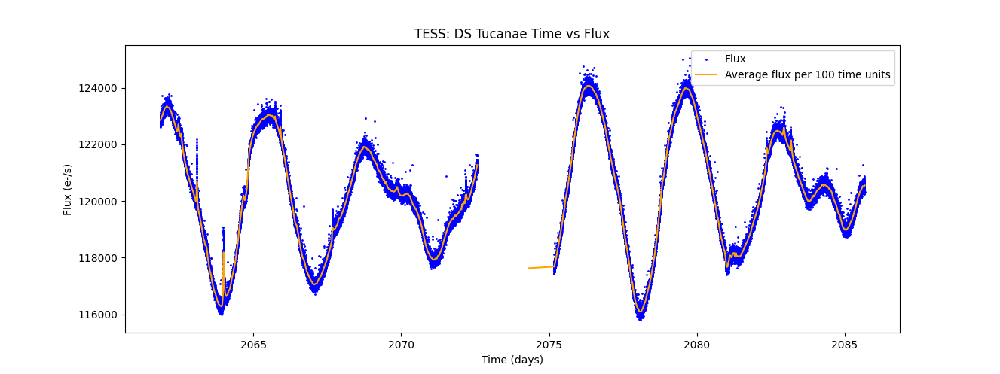

This was made just to quickly demonstrate that I can...

TESS, which stands for Transiting Exoplanet Survey Satellite, was a space telescope deployed by NASA for the purposes of monitoring thousands of stars simulataneously. It achieves this with 4 wide field-cameras to survey a sizable fraction of the sky in 27 day sessions before moving on to another target area. This necessarily creates huge amounts of data which is processed by scientists in charge of the mission before being released to the public. Subsequently other scientists will analyse the data for the tiny fluctuations in starlight luminosity that are the sign that the star hosts an exoplanet.

Here I use some of that raw data to create a flux/time graph of a binary star system known as DS Tucanae along with a superimposed trendline based on the average of that data across time.

